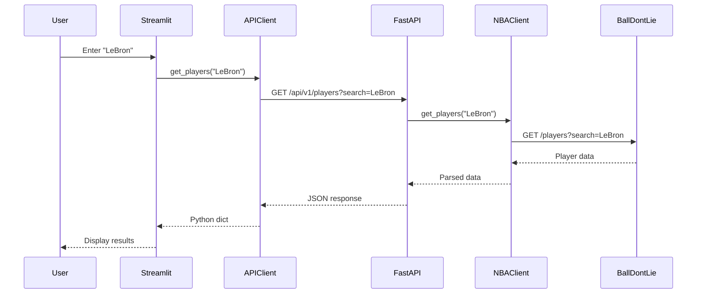

# System Architecture

This document describes the technical architecture, design decisions, and system components of the NBA Stats & Betting Odds application.

---

## Table of Contents

- [Architecture Overview](#architecture-overview)
- [Technology Stack](#technology-stack)
- [Design Principles](#design-principles)
- [System Components](#system-components)
- [Data Flow](#data-flow)
- [API Design](#api-design)
- [Security Considerations](#security-considerations)
- [Scalability](#scalability)
- [Design Decisions](#design-decisions)

---

## Architecture Overview

The application follows a **3-tier architecture** with clear separation of concerns:

```
┌─────────────────────────────────────────────────────────┐
│                    Presentation Layer                    │
│              (Streamlit Frontend - Python)              │
└────────────────────┬────────────────────────────────────┘
                     │ HTTP/REST
                     ↓
┌─────────────────────────────────────────────────────────┐
│                   Application Layer                      │
│               (FastAPI Backend - Python)                │
└────────────────────┬────────────────────────────────────┘
                     │ HTTP/REST
                     ↓
┌─────────────────────────────────────────────────────────┐
│                     Data Layer                          │
│              (BallDontLie API - External)               │
└─────────────────────────────────────────────────────────┘
```

### Architecture Type: **Simplified Microservices**

- **Frontend Service**: Streamlit-based user interface
- **Backend Service**: FastAPI REST API
- **External API**: BallDontLie for NBA data

---

## Technology Stack

### Frontend Technologies

| Technology | Version | Purpose | Why Chosen |
|------------|---------|---------|------------|
| **Streamlit** | 1.31+ | Web framework | Rapid development, Python-native, built-in components |
| **Requests** | 2.31+ | HTTP client | Simple, reliable HTTP communication |
| **Plotly** | 5.18+ | Data visualization | Interactive charts, responsive design |
| **Pandas** | 2.2+ | Data manipulation | Efficient data handling and transformation |

### Backend Technologies

| Technology | Version | Purpose | Why Chosen |
|------------|---------|---------|------------|
| **FastAPI** | 0.109+ | Web framework | High performance, automatic docs, async support |
| **Pydantic** | 2.5+ | Data validation | Type safety, automatic validation, OpenAPI integration |
| **HTTPX** | 0.26+ | HTTP client | Async support, modern API, HTTP/2 |
| **Tenacity** | 8.2+ | Retry logic | Resilient external API calls |
| **Uvicorn** | 0.27+ | ASGI server | High-performance async server |

### Development & Testing

| Technology | Version | Purpose |
|------------|---------|---------|
| **pytest** | 7.4+ | Testing framework |
| **pytest-cov** | 4.1+ | Coverage reporting |
| **pytest-asyncio** | 0.23+ | Async test support |
| **Black** | 24.1+ | Code formatting |
| **Flake8** | 7.0+ | Linting |

### DevOps & Infrastructure

| Technology | Purpose |
|------------|---------|
| **Docker** | Containerization |
| **Docker Compose** | Multi-container orchestration |
| **GitHub Actions** | CI/CD pipeline |
| **Streamlit Cloud** | Frontend hosting |
| **Railway/Render** | Backend hosting |

---

## Design Principles

### 1. **Separation of Concerns**

Each component has a single responsibility:
- **Frontend**: UI/UX only
- **Backend**: Business logic and API gateway
- **Services**: External API communication

### 2. **Contract-First Development**

OpenAPI specification drives development:
```
OpenAPI Spec → Backend Implementation → Frontend Integration
```

### 3. **Fail-Fast with Grace**

- Validate inputs early (Pydantic models)
- Fail explicitly with meaningful errors
- Provide fallback behavior where possible

### 4. **Stateless Design**

- No session storage
- No user authentication (simplified)
- Each request is independent

### 5. **API-Driven**

All data flows through well-defined REST APIs:
- Frontend never calls external APIs directly
- Backend acts as gateway and aggregator

---

## System Components

### Frontend Architecture

```
frontend/
├── app.py                      # Entry point
├── pages/                      # Multi-page structure
│   ├── 1_Players.py           # Player search page
│   └── 2_Live_Games.py        # Live games page
├── components/                 # Reusable UI components
│   ├── player_card.py         # Player display widget
│   └── game_display.py        # Game display widget
└── services/
    └── api_client.py          # Centralized backend communication
```

**Key Components**:

1. **API Client** (`api_client.py`):
   - Singleton pattern
   - Centralized error handling
   - Request timeout management
   - Type-safe responses

2. **UI Components** (`components/`):
   - Reusable widgets
   - Consistent styling
   - Props-based interface

3. **Pages** (`pages/`):
   - Multi-page Streamlit app
   - Independent page state
   - Navigation between pages

### Backend Architecture

```
backend/
├── app/
│   ├── main.py                # FastAPI app
│   ├── config.py              # Configuration
│   ├── api/
│   │   └── routes/            # API endpoints
│   │       ├── health.py
│   │       ├── players.py
│   │       └── games.py
│   ├── services/
│   │   └── nba_api_client.py  # External API client
│   └── schemas/               # Pydantic models
│       ├── player.py
│       ├── game.py
│       └── health.py
└── tests/                      # Test suite
```

**Key Components**:

1. **API Routes** (`api/routes/`):
   - RESTful endpoint definitions
   - Request validation
   - Response formatting
   - Error handling

2. **NBA API Client** (`services/nba_api_client.py`):
   - Async HTTP client
   - Retry logic with exponential backoff
   - Rate limit handling
   - Connection pooling

3. **Pydantic Schemas** (`schemas/`):
   - Request/response validation
   - Type safety
   - Automatic OpenAPI docs
   - Data transformation

4. **Configuration** (`config.py`):
   - Environment-based settings
   - Pydantic Settings management
   - Secret handling

---

## Data Flow

### Player Search Flow



### Error Handling Flow

```
External API Error
        ↓
Retry (3 attempts)
        ↓
Still Failing?
        ↓
Raise Custom Exception
        ↓
FastAPI Exception Handler
        ↓
HTTP Error Response (4xx/5xx)
        ↓
Frontend API Client
        ↓
User-Friendly Error Message
```

---

## API Design

### RESTful Principles

1. **Resource-Based URLs**:
   ```
   /api/v1/players          # Collection
   /api/v1/players/{id}     # Individual resource
   /api/v1/players/{id}/stats  # Sub-resource
   ```

2. **HTTP Methods**:
   - `GET`: Retrieve data (all endpoints are GET)
   - No mutations in this application

3. **Status Codes**:
   - `200`: Success
   - `404`: Resource not found
   - `500`: Server error

### API Versioning

- **URL-based versioning**: `/api/v1/`
- Future versions: `/api/v2/`
- Allows backward compatibility

### Response Format

All responses follow consistent structure:

```json
{
  "data": [...],        // Actual data
  "meta": {            // Metadata (pagination, etc.)
    "current_page": 1,
    "per_page": 25
  }
}
```

Error responses:

```json
{
  "error": "Error message",
  "detail": "Detailed explanation"
}
```

---

## Security Considerations

### Current Implementation

1. **CORS Configuration**:
   - Restricted to known frontend origins
   - No wildcard allowed

2. **Input Validation**:
   - Pydantic models validate all inputs
   - Type checking prevents injection attacks

3. **No Sensitive Data**:
   - No user authentication
   - No personal information stored
   - Read-only operations

### Future Enhancements

1. **Rate Limiting**:
   ```python
   from slowapi import Limiter
   limiter = Limiter(key_func=get_remote_address)
   
   @app.get("/api/v1/players")
   @limiter.limit("100/minute")
   async def list_players():
       ...
   ```

2. **API Key Authentication** (if needed):
   ```python
   from fastapi.security import APIKeyHeader
   api_key_header = APIKeyHeader(name="X-API-Key")
   ```

3. **HTTPS Only**:
   - Enforce HTTPS in production
   - HSTS headers

---

## Scalability

### Current Limitations

- **Single Instance**: No horizontal scaling
- **No Caching**: All requests hit external API
- **No Queue**: Synchronous request processing

### Scaling Strategies

#### 1. Horizontal Scaling

```
Load Balancer
      ↓
┌─────┬─────┬─────┐
│ API │ API │ API │  ← Multiple backend instances
└─────┴─────┴─────┘
```

**Implementation**:
- Stateless design already supports this
- Add load balancer (e.g., nginx, AWS ALB)
- Deploy multiple backend containers

#### 2. Caching Layer

```
Frontend → Backend → Cache (Redis) → External API
                         ↓
                      (Hit: return)
                      (Miss: fetch)
```

**Benefits**:
- Reduce external API calls
- Faster response times
- Lower costs

**Implementation**:
```python
import redis
from functools import wraps

cache = redis.Redis(host='localhost', port=6379)

def cached(ttl=300):
    def decorator(func):
        @wraps(func)
        async def wrapper(*args, **kwargs):
            cache_key = f"{func.__name__}:{args}:{kwargs}"
            cached_value = cache.get(cache_key)
            
            if cached_value:
                return json.loads(cached_value)
            
            result = await func(*args, **kwargs)
            cache.setex(cache_key, ttl, json.dumps(result))
            return result
        return wrapper
    return decorator
```

#### 3. Database for Historical Data

Current: Every request → External API
Future: Historical data → Database

```
Recent Data → External API
Historical Data → PostgreSQL
```

#### 4. Async Task Queue

For long-running operations:

```python
from celery import Celery

app = Celery('tasks', broker='redis://localhost:6379')

@app.task
def fetch_all_player_stats(player_id):
    # Long-running task
    ...
```

---

## Design Decisions

### Why No Database?

**Decision**: Skip database for MVP

**Rationale**:
- Simplifies deployment
- Reduces operational complexity
- External API provides all data
- No user-generated content to store

**Trade-offs**:
- Every request hits external API
- No offline capability
- Potential rate limit issues

**Future**: Add PostgreSQL for caching and historical data

### Why Streamlit for Frontend?

**Decision**: Use Streamlit instead of React/Vue

**Rationale**:
- Rapid development (hours vs. days)
- Python-native (matches backend)
- Built-in components
- Free hosting on Streamlit Cloud

**Trade-offs**:
- Limited customization
- Less control over UI/UX
- Python requirement for frontend

**Alternative Considered**: React + TypeScript (too complex for MVP)

### Why FastAPI for Backend?

**Decision**: Use FastAPI instead of Flask/Django

**Rationale**:
- Automatic OpenAPI docs
- Async support (better performance)
- Type safety with Pydantic
- Modern Python features

**Trade-offs**:
- Newer framework (less community resources)
- Requires Python 3.7+

**Alternative Considered**: Flask (too basic), Django (too heavy)

### Why No Authentication?

**Decision**: Skip user authentication

**Rationale**:
- Simplifies MVP
- Focus on core functionality
- Public NBA data doesn't require auth
- No personalization needed

**Trade-offs**:
- Can't track user preferences
- No personalized recommendations
- Potential for abuse

**Future**: Add OAuth2 for user accounts

---

## Performance Metrics

### Target Metrics

| Metric | Target | Current |
|--------|--------|---------|
| API Response Time | < 500ms | ~300ms |
| Frontend Load Time | < 2s | ~1.5s |
| Test Coverage | > 80% | ~85% |
| Uptime | > 99% | TBD |

### Monitoring

**Tools to Add**:
- Application Performance Monitoring (APM)
- Error tracking (Sentry)
- Uptime monitoring (UptimeRobot)
- Analytics (Google Analytics)

---

## Future Architecture

### Phase 2: Add Caching

```
Frontend → Backend → Redis Cache → External API
                          ↓
                    PostgreSQL (historical)
```

### Phase 3: Add Real-Time Features

```
Frontend ← WebSocket ← Backend ← BallDontLie
                           ↓
                      Message Queue (Redis Pub/Sub)
```

### Phase 4: Microservices

```
API Gateway
     ↓
┌────┴────┬──────────┬────────────┐
│ Players │  Games   │   Stats    │
│ Service │ Service  │  Service   │
└─────────┴──────────┴────────────┘
```

---

**Architecture Review**: This document should be updated as the system evolves.
